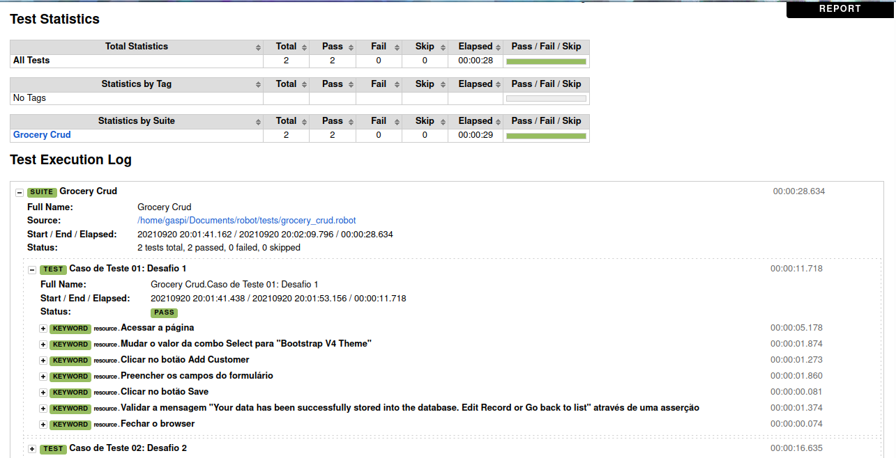

# Prova Técnica DBC
Este arquivo possui como objetivo apresentar ao público uma automação em página Web realizada utilizando o framework RobotFramework e a biblioteca Selenium na linguagem de programação Python. No decorrer do documento serão dados mais detalhes acerca do processo de teste.

## Configurações do sistema
* Ubuntu 20.04 LTS
* Intel® Core™ i5-3337U
* 8GB RAM

## Desafio 01 (RobotFramework)
* Dependências
* Como instalar
* Como executar
* Interpretando o relatório

## Dependências

- [ ] Visual Studio Code (Opcional) 
- [ ] Python 3.8.10
- [ ] Gerenciador Pip 
- [ ] RobotFramework
- [ ] Selenium Library
- [ ] Chromedriver 

## Como instalar
O tutorial será direcionado para execução no sistema operacional Ubuntu, visto que este foi o sistema utilizado pelo autor para execução dos testes.
### Python 3.8.10 e Gerenciador Pip
Normalmente o Python já vem instalado nativamente na máquina Ubuntu. Mesmo assim, é interessante realizar a checagem da linguagem no terminal através do comando:
```bash
which python3
```
que deve retornar algo como:
```/usr/bin/python3```
.Caso haja algum erro relacionado à instalação do python, você pode instalar o mesmo através do comando Apt-get:
```bash
sudo apt-get install python3
```
No caso do Pip, você pode verificar a versão atual presente no sistema através do comando ```pip --version```, caso o gerenciador de pacotes não tenha sido instalado juntamento ao python, você pode instalar ele através do comando:
```bash
sudo apt-get install python3-pip
```

### Visual Studio Code
O Visual Studio Code (vscode) foi o editor escolhido pelo desenvolvedor para o desenvolvimento da aplicação de automação web, mas você está livre para usar o editor de sua preferência para realizar o mesmo processo. Caso você não possua o editor instalado na sua máquina, é possível instalar facilmente através do comando:
```bash
sudo snap install --classic code
```
### RobotFramework
A instalação do robotframework é realizada através do gerenciador de pacotes pip, então no terminal ubuntu você pode estar realizando a instalação através do comando:
```bash
pip install robotframework
```

### Selenium Library
O robotframework traz algumas bibliotecas por padrão em sua instalação e outras que precisam ser baixadas através do pip, como é o caso da Selenium Library. Sendo assim, caso você não tenha instalado o comando é:
```bash
pip install --upgrade robotframework-seleniumlibrary
```

### Webdriver
Para realizar o teste de um sistema Web através de um navegador é necessário ter instalado o webdriver do navegador a ser utilizado, no caso deste projeto o navegador escolhido foi o Google Chrome. Para realizar a instalação, primeiramente é necessário saber qual a versão atual do seu navegador chrome, que pode ser encontrada seguindo os passos demonstrados nas imagens a seguir:


Depois de identificar a versão do chrome, acessar o link https://chromedriver.chromium.org/downloads, selecionar a versão verificada anteriormente nas imagens e baixar o arquivo "chromedriver_linux64.zip". Após concluído o download, abrir o diretório onde o arquivo foi baixado, clicar com o botão direito do mouse e selecionar a opção "Abrir no terminal", estando no terminal digitar o comando ```sudo mv chomedriver /usr/local/bin/```. Tendo feito tudo isso você pode confirmar a instalação do chromedriver através do comando ```chromedriver --version```

## Como executar
Para começar é necessário realizar o git pull ou baixar o diretório manualmente na sua máquina para ter acesso ao conteúdo. Após isso, ao acessar o vscode pela primeira vez vão ser sugeridas algumas opções como iniciar um novo projeto ou buscar um projeto já existente, nesse momento você pode buscar por um projeto existente e navegar até chegar ao diretório onde você armazenou o repositório atual. Estando com o vscode aberto com o conteúdo do projeto presente serão observados quatro diretórios, sendo eles: resources, tests, results e venv. Cada diretório possui um papel a desempenhar, o diretório resources armazena o arquivo `resource.robot` que possui os métodos utilizados para implementação do projeto, o diretório tests armazena o arquivo `grocery_crud.robot` que possui o passo-a-passo de todos os casos de teste implementados para a automação utilizando o ATDD(Aceptance Test Driven Development) como premissa para escrita. Além disso, o diretório result armazena os arquivos `log.html`, `output.xml` e `report.hml` que são utilizados para observar o resultado dos testes executados e o diretório venv que guarda o compilador utilizado com todas as dependências do projeto do robot já instaladas (dependências que podem ser baixadas com o pip).
Sabendo disso e tendo todo o ambiente configurado, você pode acessar o terminal do vscode de três formas: pressionando os atalhos `ctrl + shift + ´`, pressionando os atalhos `ctrl + shift + p` e digitando "Python: Create Terminal" e clicar na opção que surgir, ou apenas clicar no terminal da plataforma, caso o mesmo esteja presente. Estando no terminal digitar o comando `robot -d ./results tests/grocery_crud.robot` este comando visa executar o arquivo `grocery_crud.robot` presente no diretório tests e armazenar o relatório da suite de teste no diretório results, é possível informar o diretório devido ao parâmetro -d, se você possuir curiosidade de saber o que outros parâmetros fazem pode ficar a vontade em digitar `robot -help` e ler a documentação do comando. Tendo realizado todos esses passos é esperado que o chrome abra e realize os testes automaticamente, quando o navegador encerrar significa que os testes foram realizados e os resultados podem ser acompanhados através do terminal ou dos arquivos presentes no diretório results.

## Interpretando o relatório
Conforme comentado anteriormente, o resultado é apresentado de diferentes formas em três arquivos distintos, sendo a primeira imagem representada pelo arquivo `log.html`, a segunda imagem representada pelo arquivo `report.html` e a terceira imagem representada pelo arquivo `output.xml`.


* Arquivo de Log: o arquivo de log é bastante utilizado no momento do desenvolvimento por apresentar detalhadamente o processo de execução e facilitar o processo de debug.


* Arquivo de Report: ele costuma ser o artefato de relatório de testes por apresentar de forma mais bonita o resultado dos testes e também por fornecer a duração da rotina de testes.


* Arquivo de output: esse é o arquivo mais técnico, quando o arquivo de log não for suficiente para identificar o que houve de errado no desenvolvimento esse é o arquivo certo para se olhar.

## Bugs Identificados
* Campo `SalesRepEmployeeNumber` na tela de Add Record só pôde ser preenchido por valores numéricos, quando na documentação foi solicitado que o campo fosse preenchido por uma String.


